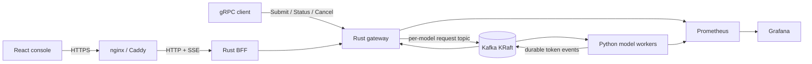
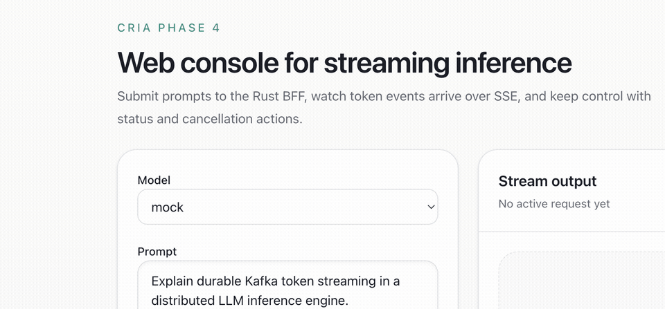

# Cria — Distributed LLM Inference

[](https://github.com/sanjayshanmugap/cria/actions/workflows/ci.yaml)
[](https://github.com/sanjayshanmugap/cria/actions/workflows/nightly-load.yaml)
[](https://github.com/sanjayshanmugap/cria/actions/workflows/publish-images.yaml)
[](https://github.com/sanjayshanmugap/cria/releases)
[](LICENSE)

A Kafka-native distributed LLM inference engine with durable token streaming, cancellation, observability, and Kubernetes-native scaling.

## Architecture



The gateway writes model-routed inference jobs to Kafka. Workers run a
deterministic mock or Transformers model and publish every lifecycle event and
generated token to a durable topic. The gateway consumes those events and
streams them to gRPC or browser SSE clients.

See [the architecture notes](docs/architecture.md) for ownership, failure
behavior, and trade-offs.

## What Differentiates This

- Durable token events are stored in Kafka instead of sent only over transient worker callbacks.
- Requests support cancellation and status lookup.
- The worker has a backend interface with mock and Hugging Face Transformers implementations.
- The gateway exposes Prometheus metrics and structured logs.
- Kubernetes manifests include CPU HPA plus optional KEDA scaling by Kafka lag.

## Quick Start

```bash
git clone https://github.com/sanjayshanmugap/cria.git
cd cria
cp .env.example .env
docker compose up --build -d
python scripts/smoke_test.py
```

Open the web console at <http://localhost:3000>. Prometheus is available at
<http://localhost:9091> and the provisioned Grafana dashboard at
<http://localhost:3001>.

The default worker backend is `mock`, so local development does not require
downloading TinyLLaMA. For CLI access:

```bash
cd workers/python
python client.py submit --prompt "Explain durable Kafka token streaming" --max-tokens 32
```

Start the optional TinyLLaMA profile:

```bash
docker compose --profile llm up --build
```

See [docs/demo.md](docs/demo.md) for worker scaling, logs, reset commands, and
sharing the browser demo through a free Cloudflare Quick Tunnel.

## Demo and Evidence

[](docs/assets/cria-console.png)

- Reproducible benchmark methodology and raw workflow artifacts:
  [docs/RESULTS.md](docs/RESULTS.md)
- Provisioned observability evidence:
  [Grafana dashboard screenshot](docs/assets/cria-grafana.png)
- Local and temporary public demo:
  [docs/demo.md](docs/demo.md)
- Canonical Helm chart:
  [helm/cria](helm/cria)
- OCI HTTPS deployment, backup, rollback, and cost controls:
  [operations runbook](docs/runbooks/operations.md)
- Role-specific, evidence-backed portfolio bullets:
  [docs/RESUME.md](docs/RESUME.md)
- Release scope and verification evidence:
  [CHANGELOG.md](CHANGELOG.md)

The checked-in Apple M4 mock baseline completed 72/72 requests. At concurrency
two, two workers delivered 53.57 tokens/s with 379.1 ms p95 TTFT—a 1.80x
throughput increase over one worker at matched concurrency. These values
measure the distributed transport path, not real-model inference.

## Design Decisions

- **Kafka token durability:** lifecycle and token events survive worker/gateway
  disconnects and can be replayed within retention instead of existing only in
  transient RPC callbacks.
- **At-least-once processing:** Cria favors recoverability over expensive
  exactly-once model execution. Clients de-duplicate by request ID and sequence
  number; worker failure after partial output can cause duplicates.
- **Topic per model:** each model has an independent request topic and consumer
  group, isolating backlogs and making Kafka-lag autoscaling model-specific.
- **Rust/Python split:** Rust owns admission control, gRPC/SSE streaming, state,
  and concurrency; Python retains the mature ML runtime and model ecosystem.
- **Mock public demo:** free CPU infrastructure cannot serve TinyLLaMA with
  credible interactive latency. The public mock mode preserves Kafka routing,
  cancellation, streaming, metrics, and failure semantics without pretending
  to benchmark model compute.

## Kubernetes

```bash
brew install kind kubectl helm
make kind-up
kubectl --context kind-cria -n inference-system \
  port-forward service/rust-control-plane 50051:50051 8080:8080
python scripts/smoke_test.py
```

See [k8s/README.md](k8s/README.md) for Prometheus access, persistence,
TinyLLaMA, HPA/KEDA prerequisites, verification, and teardown. The Helm chart
is canonical; the raw manifests are lightweight examples.

## Configuration

### Rust Gateway

| Variable | Default | Description |
| --- | --- | --- |
| `GRPC_ADDR` | `0.0.0.0:50051` | gRPC listen address |
| `METRICS_ADDR` | `0.0.0.0:9090` | Prometheus and health endpoint |
| `KAFKA_BROKERS` | `localhost:9092` | Kafka bootstrap brokers |
| `KAFKA_REQUEST_TOPIC` | `inference_requests` | Request topic |
| `KAFKA_TOKEN_TOPIC` | `inference_token_events` | Token event topic |
| `KAFKA_CONTROL_TOPIC` | `inference_control_events` | Cancellation/control topic |
| `KAFKA_GATEWAY_GROUP_ID` | unique per process | Token-event consumer group; keep unique so each gateway can observe events for its streams |
| `MODEL_ROUTES` | `mock=inference_requests.mock,tinyllama-1.1b-chat=inference_requests.tinyllama-1.1b-chat` | Comma-separated `model_id=topic` routes |
| `DEFAULT_MODEL_ID` | `mock` | Model used when clients omit `model_id` |
| `MAX_ACTIVE_REQUESTS` | `128` | Admission control limit |
| `MAX_PROMPT_CHARS` | `12000` | Prompt length limit |
| `GRPC_TLS_CERT` / `GRPC_TLS_KEY` | unset | Enable server TLS when both are set |
| `GRPC_TLS_CLIENT_CA` | unset | Client CA for mTLS |
| `GRPC_TLS_REQUIRE_CLIENT_AUTH` | `false` | Require client certificates |

### Python Worker

| Variable | Default | Description |
| --- | --- | --- |
| `BACKEND` | `mock` | `mock` or `transformers` |
| `MODEL_NAME` | `TinyLlama/TinyLlama-1.1B-Chat-v1.0` | Hugging Face model |
| `DEVICE` | `auto` | `auto`, `cpu`, or `cuda` |
| `DTYPE` | `float16` | `float16`, `bfloat16`, or `float32` |
| `MODEL_ID` | `mock` | Model this worker serves |
| `KAFKA_GROUP_ID` | `llm-inference-workers-<MODEL_ID>` | Worker consumer group |
| `KAFKA_REQUEST_TOPIC` | `inference_requests.<MODEL_ID>` | Model-specific job topic |
| `METRICS_PORT` | `9100` | Worker Prometheus metrics port |
| `TEMPERATURE` | `0.7` | Default sampling temperature |
| `TOP_P` | `0.9` | Default nucleus sampling |
| `TOP_K` | `50` | Default top-k sampling |

## Observability

The Rust gateway exposes `/metrics` and `/healthz` on `METRICS_ADDR`. Workers expose Prometheus metrics on `METRICS_PORT`, including active jobs, processed jobs, failures, cancellations, token count, and job duration.

Docker Compose starts Prometheus on <http://localhost:9091> and Grafana on
<http://localhost:3001>. The checked-in Cria dashboard and Prometheus datasource
are provisioned automatically.

## Web Console

The Rust control plane exposes a lightweight BFF on `BFF_ADDR` (default `0.0.0.0:8080`) with:

- `GET /api/models`
- `POST /api/infer` as server-sent events
- `GET /api/infer/:request_id/status`
- `POST /api/infer/:request_id/cancel`

The production React console is included in Compose at
<http://localhost:3000>. For frontend development with Vite:

```bash
cd web
npm install
VITE_BFF_PROXY_TARGET=http://localhost:8080 npm run dev
```

## API

```protobuf
service InferenceGateway {
  rpc Submit(InferenceRequest) returns (stream TokenEvent);
  rpc Cancel(CancelRequest) returns (CancelResponse);
  rpc GetStatus(StatusRequest) returns (StatusResponse);
}
```

The Python client supports all three RPCs:

```bash
cd workers/python
python client.py submit --prompt "Hello from Cria" --max-tokens 8
python client.py submit --model-id mock --prompt "Hello from Cria" --max-tokens 8
python client.py status --request-id <request-id>
python client.py cancel --request-id <request-id> --reason "user abort"
```

The default local model routes are `mock -> inference_requests.mock` and `tinyllama-1.1b-chat -> inference_requests.tinyllama-1.1b-chat`.

## mTLS

Generate development certificates:

```bash
scripts/gen-dev-certs.sh
```

Start the gateway with server TLS and client certificate verification by setting:

```bash
GRPC_TLS_CERT=certs/server.crt
GRPC_TLS_KEY=certs/server.key
GRPC_TLS_CLIENT_CA=certs/ca.crt
GRPC_TLS_REQUIRE_CLIENT_AUTH=true
```

Then call it with:

```bash
cd workers/python
python client.py --tls-ca ../../certs/ca.crt \
  --tls-cert ../../certs/client.crt \
  --tls-key ../../certs/client.key \
  --tls-server-name localhost \
  submit --prompt "Hello over mTLS" --max-tokens 8
```

## Reliability Semantics

- Request processing is at least once.
- Token event delivery is at least once.
- Clients should de-duplicate by `request_id` and `sequence_number`.
- Worker crashes can cause duplicate inference.
- Token events can be replayed while Kafka retention keeps them.
- `stream_options.replay_from_beginning` replays events cached by the active gateway for an existing `request_id`; cross-gateway Kafka replay is planned for a future hardening pass.

## Development

```bash
cd control-plane
cargo test
cargo check

cd ../workers/python
python generate_grpc.py
python -m pytest tests
python -m compileall inference_worker client.py load_test.py
```

## Troubleshooting

If a client prints the prompt but no tokens, confirm the compose stack was started after the `kafka-init` service was added:

```bash
docker compose down
docker compose up --build
```

The gateway waits for model-specific request topics, `inference_token_events`, and `inference_control_events` before serving requests. If it still hangs, check control-plane and worker logs for Kafka connectivity errors.
