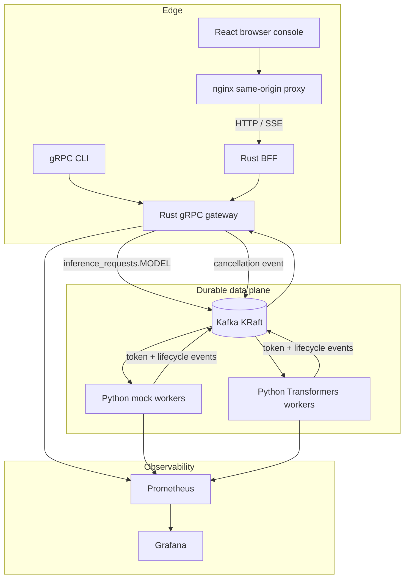

# Cria Architecture

Cria is a Kafka-native inference gateway. gRPC and browser clients connect to a
Rust control plane, the control plane enqueues jobs into model-specific Kafka
topics, and Python workers publish lifecycle and token events back to Kafka.
The gateway consumes durable events and streams them to gRPC or SSE clients.

## Components

| Component | Role |
| --- | --- |
| Rust control plane | Validates requests, enqueues jobs, streams token events, exposes health and metrics |
| Kafka | Durable job, token-event, and cancellation topics |
| Python workers | Consume jobs, run mock or Transformers inference, publish token events |
| Python client | Exercises Submit, GetStatus, and Cancel gRPC methods |
| React/nginx web | Provides the browser workflow and same-origin SSE proxy |
| Prometheus/Grafana | Scrape gateway/worker metrics and provision dashboards |

## Topics

| Topic | Producer | Consumer |
| --- | --- | --- |
| `inference_requests.<model_id>` | Control plane | That model's worker group |
| `inference_token_events` | Workers | Control plane |
| `inference_control_events` | Control plane | Worker cancellation watchers |

Docker Compose creates these topics with `kafka-init` before the gateway starts.
Helm creates a revision-scoped topic Job, while gateway and worker init
containers wait for the required topics. This ordering prevents successful pod
startup against a partially initialized Kafka cluster.

## Deployment Boundaries

- Local Compose publishes developer-only ports for gRPC, Prometheus, and
  Grafana.
- The public Compose stack binds only Caddy on 80/443. Kafka, gRPC, worker
  metrics, and Prometheus live on an internal Docker network.
- The Helm chart is canonical for Kubernetes. Per-model Services expose worker
  metrics only inside the cluster.
- mTLS protects direct gRPC deployments. Browser traffic uses Caddy-managed
  HTTPS and same-origin routing.

## Failure Handling

| Failure | Behavior |
| --- | --- |
| Kafka starts slowly | Compose healthcheck and `kafka-init` hold app startup; gateway also polls metadata before subscribing |
| Worker pod dies before commit | Kafka keeps the uncommitted job for reassignment within the worker consumer group |
| Worker dies after emitting partial tokens | Partial token events remain durable in Kafka; the job may be retried and duplicate tokens are possible |
| Control plane restarts | In-flight gRPC streams are lost, but Kafka retains jobs and token events while retention allows |
| Duplicate inference | Allowed by at-least-once semantics; clients should de-duplicate by `request_id` and `sequence_number` |
| Client cancels | Gateway records cancellation and publishes a control event; workers stop when they observe it |

## Current Non-Goals

- Exactly-once inference semantics
- Service mesh integration
- Full OAuth or IAM
- Kafka TLS/SASL in the local development stack
